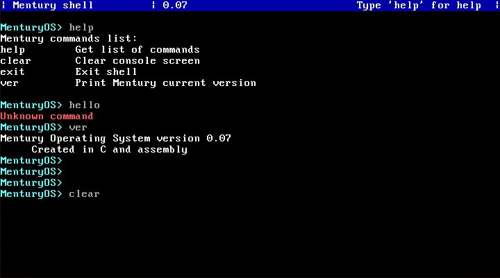

# Mentury
### A 64-bit operating system



#### How to compile?
First of all, you need to install some packages:
```Bash
sudo apt install gcc nasm ld
```
Then you can run compiling Mentury source code:
```Bash
sh compile64.sh
```
### Mentury possibilities

 - [x] VGA 80x25 driver
 - [x] Keyboard support (PS/2 and USB)
 - [x] Memory managment
 - [] Filesystem
 - [] Network support
 - [] File editor
